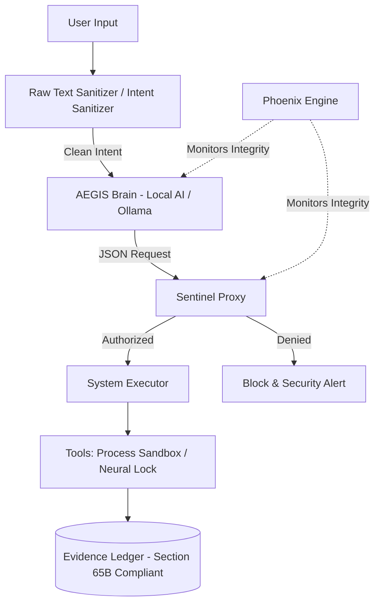

[🌐 Visit Official Website](https://nomaanos-code.github.io/NomaanOS-Core/)

   

# 🛡️ NomaanOS Core: The Sovereign AI Operating Environment

> **v6.0 "Command Center" | Status: STABLE (Maturity: 10/10)**
> **Author:** Nomaan Khan | Tech Visionary & Cybersecurity Researcher | Scholar @ IHFC - IIT Delhi

NomaanOS is an agentic overlay for Linux kernels designed to enforce **Digital Sovereignty**. Unlike traditional shells, it decouples AI Intent from system execution using a deterministic Sentinel Proxy, ensuring immunity against prompt injection and hallucinations.

---

## 🌟 Core Architecture (The "Aegis Protocol")

| Component | Status | Function |
| :--- | :--- | :--- |
| 🧠 **AEGIS Brain** | `SOVEREIGN` | Local Intelligence (Phi-3/Llama via Ollama). 100% Offline Capable. |
| 🔥 **Phoenix Engine** | `SYNCED` | Cryptographic Self-Healing. Restores corrupted logic automatically. |
| ⌨️ **Neural Lock** | `ACTIVE` | Continuous Authentication via Keystroke Dynamics ($\Delta < 0.30$). |
| ⛩️ **Sentinel Proxy** | `HARDENED` | Deterministic Logic Gate. Blocks unauthorized AI commands. |
| 📦 **Process Sandbox** | `ACTIVE` | Isolates high-CPU processes using SIGSTOP signals. |
| ☢️ **Panic Button** | `ARMED` | Scorched Earth Protocol for emergency data destruction. |

---

## 🛠️ Tech Stack & Requirements

* **Core:** Python 3.10+ / Bash / Linux (Pop!_OS / Alpine / Termux)
* **Local AI:** Ollama (Phi-3 / Llama-3)
* **Security:** AES-256 Encryption, Sandboxed Execution, Keystroke Dynamics

---

## 📐 System Architecture (The "Aegis Protocol")



---

## ⚖️ Security & Intellectual Property Policy

* **Ownership:** NomaanOS Core is the proprietary research and intellectual property of **Nomaan Khan**.
* **Audit Ledger:** All actions are cryptographically logged in `data/evidence_ledger.json`.
* **Licensing Inquiries:** `nikki08@duck.com`

---
### 🛡️ Red-Team Adversarial Hardening Status
- **Benchmark Score:** `100.0% Immunity` (5/5 Attack Vectors Mitigated)
- **Verified Protection:** Direct Injections, Command Escapes, System Overrides, Data Exfiltration & Base64 Obfuscated Payloads.
- **Latest Audit Log:** [`redteam_benchmark.json`](./redteam_benchmark.json)


---
### 🐳 One-Click Docker Execution

Run NomaanOS Core and Aegis Red-Team Engine in an isolated sandbox:

```bash
# Clone repository
git clone https://github.com/NomaanOS-Code/NomaanOS-Core.git
cd NomaanOS-Core

# Build and run via Docker
docker build -t nomaanos-core .
docker run --rm nomaanos-core
```
